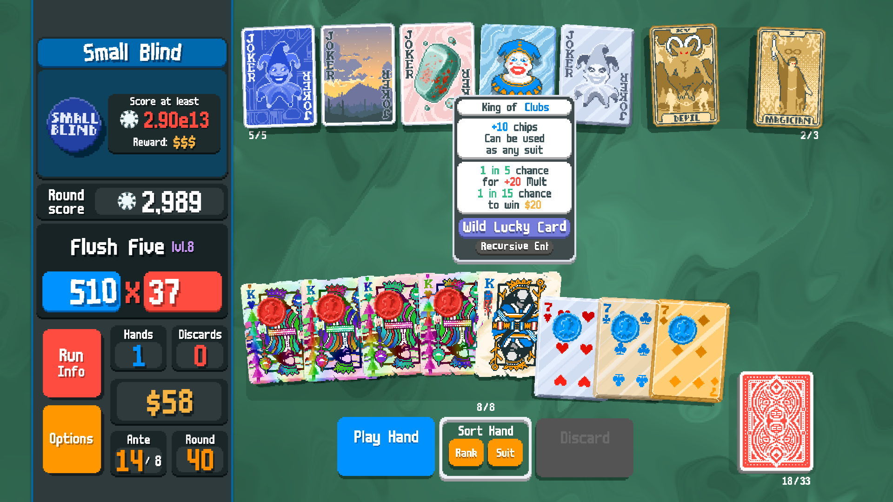
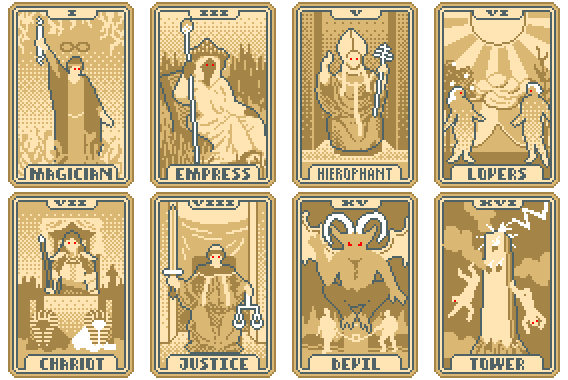

#  Recursive Enhancements
Recursive Enhancements is a Balatro mod that allows you to simultaneously have all eight vanilla enhancements on a single playing card.

# Requirements
Steamodded [Click here](https://github.com/Steamodded/smods/wiki)

Lovely [Click here](https://github.com/ethangreen-dev/lovely-injector) (You should already have this if you have Steammodded.)

# Features
Adds 247 new enhancements. (Every combination of the eight default enhancements.)

Enhancement tarot cards can now add or remove their respective enhancements from selected cards.

# Notice

This mod is currently in beta.

There are a few kinks left but it will be finished shortly.

# To do list for upcoming updates

Fix glass cards (I didn't make most of them transparent)

Fix Vampire and Midas Mask (They work, but not as well as they should.)

Fix SMODS.has_enhancement() (I think I bork it.)

Consider fixing standard packs.

Add a custom, enhancement themed deck.

